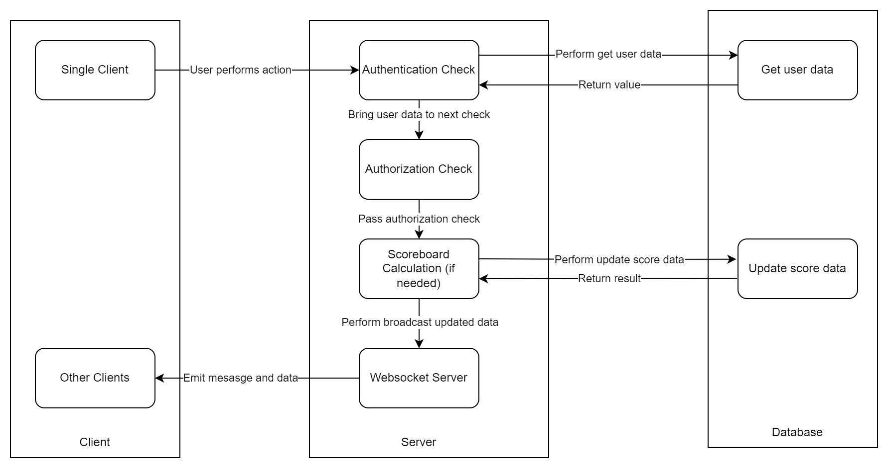

# Scoreboard Update Module Design

This document details the design for the "Scoreboard Update Module" within the API service. This module is responsible for handling user score updates and maintaining a live-updated scoreboard displaying the top 10 users.

## Functionality:
- Receives and validates score update requests from clients.
- Updates user scores in the database.
- Broadcasts updated scoreboard data to connected clients in real-time.

## Security Considerations:
Authorization checks are implemented to prevent unauthorized score manipulation.

# Create a diagram to illustrate the flow of execution. 

## Flow of Execution:
1. **Client Action**: A user performs an action on the website that results in a score increase.
2. **API Request**: The client sends an API request to the `/score` endpoint on the API service with relevant data, including user access token.
3. **Authentication**: The server will receive the data from the request. Based on the access token, the decoded data will be used to access user information in the database, including authorization data.
3. **Authorization**: Based on the authorization data received in the previous step, the API service verifies the user's authorization to update the score.
4. **Score Update**: If authorized, the service updates the user's score in the database.
5. **Scoreboard Calculation**: The updated top 10 scores are retrieved from the database.
6. **Real-time Update**: The server broadcasts the updated scoreboard data to all connected clients via a WebSocket connection.
7. **Client Update**: Clients receive the updated scoreboard data and dynamically update the displayed scoreboard on the website.

# Add additional comments for improvement you may have in the documentation.
- Consider implementing debounce functionality to mitigate excessive API calls triggered by rapid user actions.
- Instead of using WebSockets for real-time updates, consider implementing polling mechanism where data is updated at regular intervals, such as once every minute. This approach can optimize server resources and simplify the implementation by avoiding the complexities associated with WebSockets. But we should ensure that the polling interval is chosen carefully to balance between real-time updates and server load.
- Consider implementing logging (winston, morgan,...) and monitoring to track scoreboard updates and detect any suspicious activities.
- Consider implementing rate limiting on API requests

# Your specification will be given to a backend engineering team to implement.

## Overview:
The specification provided here delineates the scope, requirements, and implementation guidelines for the Scoreboard Update Module within the API service. It serves as a comprehensive roadmap for the backend engineering team to translate business needs into technical solutions effectively.

## Requirements Documentation:
1. **Functional Requirements**:
   - Detailed description of the functionality expected from the Scoreboard Update Module, including receiving, validating, and processing score update requests, updating user scores in the database, and broadcasting updated scoreboard data in real-time.
   - Definition of API endpoints, request/response formats, and expected behaviors for each endpoint.
   
2. **Security Requirements**:
   - Clear definition of authorization and authentication mechanisms to prevent unauthorized score manipulation.
   - Specification of encryption protocols, input validation measures, and other security features to safeguard sensitive data and prevent common security threats.

3. **Performance Requirements**:
   - Identification of performance benchmarks and expectations for response times, scalability, and system resource utilization.
   - Guidelines for optimizing database queries, caching strategies, and other performance-enhancing techniques.

4. **Scalability and Resilience**:
   - Consideration of scalability requirements to accommodate increasing user loads and scoreboard updates.
   - Guidelines for implementing fault-tolerant and resilient architecture to minimize downtime and ensure system reliability.

## Design Documentation:
1. **Architecture Design**:
   - High-level overview of the system architecture, including component diagrams, data flow diagrams, and interaction diagrams.
   - Identification of key components, their responsibilities, and dependencies.

2. **Database Schema Design**:
   - Definition of database schema, including tables, relationships, and indices necessary to store user scores and related data.
   - Consideration of database normalization, data integrity constraints, and performance optimizations.

3. **API Design**:
   - Definition of API endpoints, HTTP methods, request/response payloads, and error handling mechanisms.
   - Specification of API versioning, authentication headers, and response status codes.

4. **Websocket design**
   - Outline the integration of WebSocket for real-time data updates.
   - Describe how WebSocket connections will be managed and broadcasted to clients upon score updates.

## Implementation Guidelines:
1. **Technology Stack**:
   - Selection of appropriate backend frameworks, libraries, and tools based on project requirements, scalability considerations, and team expertise.

2. **Coding Standards**:
   - Adherence to coding conventions, style guidelines, and best practices to ensure code maintainability, readability, and consistency.
   - Specification of code review processes, version control practices, and branching strategies.

3. **Testing Strategy**:
   - Definition of unit testing, integration testing, and end-to-end testing strategies to ensure code quality and reliability.
   - Specification of test coverage targets, test data generation approaches, and continuous integration/continuous deployment (CI/CD) pipelines.

4. **Documentation**:
   - Creation of comprehensive documentation for API endpoints, data models, configuration settings, and deployment procedures.
   - Inclusion of code comments, README files, and other documentation artifacts to facilitate collaboration and knowledge sharing within the team.

## Collaboration and Communication:
1. **Team Collaboration**:
   - Collaboration with frontend developers, QA engineers, and DevOps specialists to ensure seamless integration, testing, and deployment of the Scoreboard Update Module.

2. **Progress Reporting**:
   - Regular updates on project progress, including status reports, sprint demos, and retrospective meetings.
   - Timely communication of any challenges, risks, or blockers encountered during development.

## Review and Iteration:
1. **Peer Review**:
   - Conducting peer code reviews to ensure code quality, adherence to specifications, and knowledge sharing within the team.

2. **Feedback Incorporation**:
   - Incorporation of feedback from stakeholders, QA testing, and peer reviews to iteratively improve the implementation and address any identified issues or gaps.

3. **Continuous Improvement**:
   - Encouragement of a culture of continuous improvement, learning, and innovation within the backend engineering team to drive ongoing optimization and refinement of the Scoreboard Update Module.